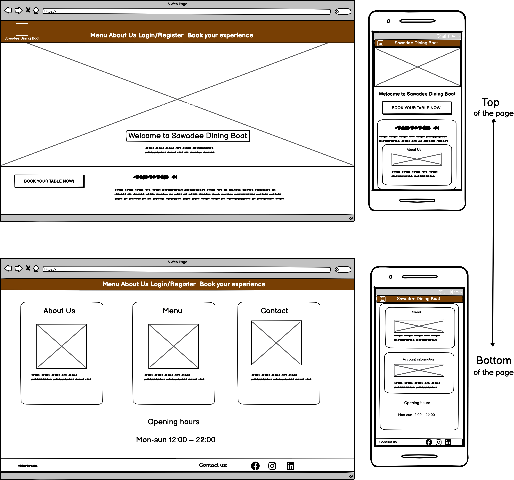

# Sawadee Dining Boat

<!-- EDIT: Welcome to **Sawadee Dining Boat** - your perfect escape for a memorable private boat trip. *Reserve now* and enjoy the most amazing views while dining.  -->

This project was created to provide an easy-to-use platform for customers to book their trips, manage reservations, and ensure a seamless experience. By integrating a robust booking system with Django, it helps users book their desired time slots and view their booking details with ease. The goal is to create an enjoyable and user-friendly experience while managing all aspects of the reservation process.

Sawadee Dining Boat was built to serve as a foundation for a potential real-world application, focusing on efficient reservation handling and a smooth user interface.

<!-- TO-DO: Add an image of the finished site here. I like to use [amiresponsive](https://ui.dev/amiresponsive) to get an image of my site on all device sizes, and amiresponsive allows you to click links on the page and scroll, so each device can show a different element of your site.  -->

<!-- TO-DO: Add a link to the live site here, for Milestone 1 this will be the GitHub Pages Link from when you deployed the site.  -->

<!-- TO-DO: If you want to add optional [shields.io](https://shields.io) badges to your README, I like to add them to this section. -->

---

## CONTENTS

* [User Experience](#user-experience-ux)
  * [User Stories](#user-stories)

* [Design](#design)
  * [Colour Scheme](#colour-scheme)
  * [Typography](#typography)
  * [Imagery](#imagery)
  * [Wireframes](#wireframes)

* [Features](#features)
  * [General Features on Each Page](#general-features-on-each-page)
  * [Future Implementations](#future-implementations)
  * [Accessibility](#accessibility)

* [Technologies Used](#technologies-used)
  * [Languages Used](#languages-used)
  * [Frameworks, Libraries & Programs Used](#frameworks-libraries--programs-used)

* [Deployment & Local Development](#deployment--local-development)
  * [Deployment](#deployment)
  * [Local Development](#local-development)
    * [How to Fork](#how-to-fork)
    * [How to Clone](#how-to-clone)

* [Testing](#testing)

* [Credits](#credits)
  * [Code Used](#code-used)
  * [Content](#content)
  * [Media](#media)
  * [Acknowledgments](#acknowledgments)

---

## User Experience (UX)

### Initial Discussion

Sawadee Dining Boat is a unique dining experience where guests can book an entire boat for a scenic 2-hour trip while enjoying exquisite Thai cuisine. The restaurant operates multiple trips daily and caters to groups of 4–20 people. The website is designed to streamline the booking process, showcase the menu, and provide key information about the dining experience.

With the growing popularity of the restaurant, there is a need for an efficient online platform where customers can:
* Book a dining experience easily.
* View the current menu and updates.
* Manage their bookings.
* Learn about the restaurant’s concept and how it works.
* Contact the restaurant with questions or feedback.

Key Information for the Site
* What the Sawadee Dining Boat experience is and how it works.
* How to book a dining experience, including available dates and times.
* A menu showcasing the restaurant’s offerings.
* A way to manage reservations, including editing or canceling bookings.
* Details about promotions, such as the 10% discount on the first visit for registered users.
* Contact information and a form for inquiries or feedback.

### User Stories

#### Client Goals
* To have a visually appealing and responsive website accessible on all devices.
* To make it easy for potential customers to understand the dining experience and book a trip.
* To allow returning customers to manage their reservations and view updated menu items.
* To provide a platform for staff to manage the menu and bookings efficiently.

#### First-Time Visitor Goals
* I want to learn about the Sawadee Dining Boat and understand the unique dining experience.
* I want to easily navigate the website to find information on bookings and menu offerings.
* I want to feel encouraged to book my first visit, especially with a clear incentive like a discount.

#### Returning Visitor Goals
* I want to log in and manage my bookings, including editing or canceling them if needed.
* I want to view the latest menu updates and promotions.
* I want to easily contact the restaurant if I have questions about my reservation.

#### Frequent Visitor Goals
* I want to explore new menu items or updates about the dining experience.
* I want to be notified about promotions or seasonal menu updates.

  - - -

## Design 

### Colour Scheme

The color scheme for **Sawadee Dining Boat** is inspired by the rich and elegant aesthetics of **traditional Thai culture**, combined with a warm and inviting dining experience. The palette consists of **earthy tones, luxurious gold accents, and deep, warm browns** to reflect the essence of Thai hospitality, wooden boat interiors, and the golden hues often seen in Thai temples and traditional decorations.  

###  **Color Palette**
| Color | Hex Code | Description |
|--------|---------|-------------|
| **Cream** | `#fdf7f0` | Soft and neutral background for a warm, welcoming ambiance. |
| **Deep Brown** | `#3e2723` | Rich wooden tones, reminiscent of traditional Thai teak boats. |
| **Warm Sand** | `#7a4b31` | Earthy and natural, echoing the wooden textures of the boat. |
| **Golden Yellow** | `#d4af37` | Represents Thai luxury, inspired by golden Thai temples and decorations. |
| **Dark Gold** | `#b8860b` | A deeper, muted gold for a more refined and elegant touch. |
| **Soft Beige** | `#faf3e0` | Complements the other warm tones, ensuring readability and harmony. |
| **Muted Bronze** | `#724E2F` | Adds depth, resembling the aged woodwork on Thai riverboats. |

### **Why These Colors?**
- **Warm, earthy tones** – Reflect **traditional Thai wooden boats**, **bamboo interiors**, and the **natural elements of river dining**.
- **Gold accents** – Symbolize **Thai elegance, prosperity, and traditional artistry**.
- **Neutral beige and cream** – Maintain **balance and readability**, ensuring a **pleasant user experience** without overwhelming the eyes.
- **Soft contrast** – The colors were chosen to provide a **smooth, luxurious feel** while ensuring **clarity and usability**.

By combining these tones, the website captures the essence of a **traditional Thai dining boat experience**, making users feel immersed in an **authentic and visually appealing atmosphere**.

### Typography

The typography for **Sawadee Dining Boat** has been carefully selected to complement the elegant and traditional Thai dining experience. The chosen fonts provide a balance of luxury, readability, and authenticity, ensuring a sophisticated yet inviting feel throughout the website.

### Chosen Fonts
| Font | Type | Weights Used | Description |
|------|------|-------------|-------------|
| **Playfair Display** | Serif | `500`, `700` | A classic, elegant font that enhances the refined and high-quality feel of the dining experience. |
| **Lora** | Serif | `400`, `600` | A highly readable and warm serif font that blends well with the traditional Thai aesthetic. |

### Why These Fonts?
- **Playfair Display** is a luxurious and stylish serif font that evokes sophistication, perfect for headings and branding elements.
- **Lora** is a warm and welcoming serif font that ensures smooth readability in longer text, making it ideal for paragraphs and descriptions.
- Both fonts are highly legible and accessible, ensuring a positive user experience for all visitors.

### Font Preview

### Imagery

The imagery used throughout this project is carefully selected to reflect the essence of an authentic **Thai dining boat experience**. The visuals aim to evoke a sense of tradition, elegance, and cultural richness while maintaining a welcoming and luxurious ambiance.  

### Key Imagery Themes  
- **Traditional Thai Aesthetic** – Images of Thai wooden boats, intricate carvings, and warm, inviting interiors to create an immersive experience.  
- **Culinary Focus** – High-quality images of traditional Thai dishes, fresh ingredients, and artfully plated meals to showcase the dining experience.  
- **Serene Waterscape** – Photos of river views, golden sunsets over water, and softly lit dining settings to enhance the tranquil and exclusive atmosphere.  
- **Gold Accents & Warm Tones** – To complement the color scheme, imagery often incorporates golden hues, deep wood textures, and soft candlelit settings.  

The goal is to **transport visitors** into a **luxurious yet traditional Thai dining journey**, making them feel as if they are already aboard the boat.  

### Example Imagery  
  

### Wireframes

The wireframes included in this project represent the initial design and layout of the core pages of the Sawadee Dining Boat website. These wireframes will serve as a blueprint for the development process, outlining the basic structure, key components, and user interface elements of the site.

By visualizing the flow of the website, the wireframes help to establish a clear, user-friendly experience from the start. They include placeholders for the navigation bar, booking sections, footer, and other essential features that will be developed in later stages. The wireframes will evolve as the project progresses, ensuring the design stays aligned with both user needs and project goals.

#### Images of the individual wireframes:

Home Page Wireframe
 

 

Sign Up Form Wireframe
 

 

Account Page Wireframe
 

 

Booking Page Wireframe
 

 

Admin Dashboard Wireframe
 

 

Menu Page
 

 

About Us
 

 

## Features

Sawadee Dining Boat is a **Thai dining experience on a boat**, offering an elegant and user-friendly website for both customers and staff. The website allows **customers** to explore the menu and book a dining cruise, while **staff** can manage bookings and the restaurant’s menu through an intuitive interface.

---

  
Base Template

 
## **Base Template (`base.html`)**
The `base.html` file serves as the **foundation for all pages** on the site. It includes:

### **1. Global Head Elements**
- **Meta Information**
  - Defines the **site's title**, description, and keywords for **SEO optimization**.
  - Ensures the site is **mobile-friendly** with a `viewport` meta tag.

- **Favicon Support**
  - Includes **multiple favicon sizes** for different devices.
  - The favicon is a **custom Sawadee Dining Boat logo**.

- **External Styles & Libraries**
  - **Bootstrap 5.3** for **grid layout, responsive design, and UI components**.
  - **Bootstrap Icons** for easy-to-use icons.
  - **Flatpickr** for a **modern, user-friendly date picker**.
  - **Custom CSS (`style.css`)** for project-specific styles.
  

---

  
Navigation Bar

 
### **2. Navigation Bar (`navbar.html`)**
The **navbar is included dynamically** in the base template, ensuring it appears on all pages.

#### **Navbar Features:**
- **Fixed Positioning:** 
  - Stays at the **top of the page** for easy navigation.
  - Uses **backdrop blur** for a modern aesthetic.

- **Contact Information Section:**  
  - **Displayed above the navigation bar** for quick access.  
  - Includes:
    - **Address** (Bangkok, Thailand).
    - **Phone number** with an icon.

- **Navigation Links:**  
  - Home  
  - About  
  - Menu  
  - Set Sail  
  - Conditional links (shown based on user authentication status).  

#### **Authentication-Based Navbar Behavior:**
| User Type  | Displayed Links |
|------------|----------------|
| **Guest** | "Reserve Now" (Login/Register) |
| **Logged-in User** | Dashboard, Account, Create Reservation, Logout |
| **Staff User** | Dashboard, Account, Create Reservation, **Menu Management**, Logout |

#### **Call to Action (CTA) Button**
- **"Reserve Now" button** styled with a **gold gradient** for emphasis.
- **Hover effect:** Enlarges slightly and adds a glow.

---

### **3. Footer**
- **Consistent across all pages**.
- Displays:
  - **Copyright information**.
  - **All rights reserved message**.

---

### **4. Messages & Alerts**
- **Django Messages Framework**
  - Displays **success/error messages** dynamically.
  - Uses **Bootstrap alert styles** for clear notifications.
  

---

  
Home Page

 
## Home Page (`home.html`)

The Home Page serves as the introduction to the Sawadee Dining Boat experience. It features a hero section with a background video, an introductory text section, and quick navigation to key parts of the site.

### Hero Section (Video Background)

The hero section creates an immersive first impression with:
- A full-width background video showcasing water movements, enhancing the boat dining theme.
- A fallback image (`herodesktop.jpg`) that displays when the video cannot be loaded (e.g., on mobile devices).
- Overlay text introducing the dining experience, with a call-to-action button ("Make a Reservation").

#### Video Behavior:
- Autoplay, loop, and mute ensure a continuous ambient experience.
- CSS classes (`d-none d-md-block`) ensure the video is hidden on small screens to optimize performance.
- A fallback image is displayed instead on smaller devices.

### Introduction Section

A text-centered section (`#intro`) welcomes visitors with:
- A large heading ("Welcome Aboard") styled for impact.
- A lead paragraph describing the unique Thai dining experience.
- Centered text for readability and emphasis.

### Information Columns

A three-column layout (`#info-columns`) provides quick navigation to important pages:
- **About Us:** Information about the restaurant’s mission and experience.
- **Menu:** A direct link to the food menu.
- **Reservations:** A CTA to book a dining experience.

#### Column Features:
- Each column includes:
  - A title (`<h3>`)
  - A brief description (`
`)
  - A styled button (`btn-outline-primary`) with a hover effect.
- Buttons link to relevant sections (`about.html`, `menu.html`, `reservation_create`).

### Responsive & Mobile Optimization

- The hero video is replaced with an image on smaller screens (`d-block d-md-none`).
- Bootstrap's grid system (`col-md-4`) ensures columns stack on smaller devices.
- Call-to-action buttons remain accessible and visible on all screen sizes.

### User Experience Enhancements

- **Color contrast:** White text on a darker background improves readability.
- **Padding & spacing:** Ensures a clean, modern layout.
- **Consistent call-to-action placement:** Ensures users can easily make a reservation.
  

---

  
About Page 

 
## About Page (`about.html`)

The About Page provides an overview of the Sawadee Dining Boat experience, its history, and what makes it unique. It features informative sections, high-quality imagery, and a call to action for reservations.

### Page Structure

The About Page consists of the following sections:
- Introduction with an **image and description**
- A section highlighting the **unique dining experience**
- A **call-to-action** inviting users to book a reservation

### Introduction Section

- **Two-column layout** (`.row`)
- **Left side:** Displays an image (`boat_about_page.jpg`) of the boat dining experience.
- **Right side:** Text content explaining:
  - The founding of Sawadee Dining Boat in **2018**.
  - Inspiration from **authentic Thai flavors** and **waterfront dining**.
  - A **2-hour private dining experience**.

### Unique Dining Experience Section

- **Two-column layout** with reversed order on large screens (`order-lg-2`, `order-lg-1`).
- **Left side:** Displays an image (`insideboat_about_page.jpg`) showcasing the elegant boat interior.
- **Right side:** Describes the exclusive dining experience, including:
  - **Private cruise** (for groups of **4-20 guests**).
  - **Scenic 2-hour journey** from sunrise to sunset.
  - **Authentic Thai menu** curated by top chefs.
  - **Customizable events** (birthdays, anniversaries, corporate gatherings).
- **List format** improves readability.

### Call-to-Action

- A **centered section** at the bottom.
- A **headline ("Join Us for an Unforgettable Experience")** encourages engagement.
- A **lead paragraph** reinforces the Thai dining and water experience.
- A **CTA button ("Book Your Dining Cruise")** links to the reservation system.

### Design & User Experience

- **High-quality images** enhance the visual appeal.
- **Text alignment and spacing** improve readability.
- **Contrast between text and background** ensures accessibility.
- **Bootstrap grid classes (`col-lg-6`)** maintain responsiveness across devices.
- **Rounded image corners and shadows (`shadow-lg`, `rounded`)** create a polished, modern look.

### Mobile & Responsive Behavior

- **Images adjust** dynamically to different screen sizes.
- **Columns stack vertically** on smaller devices for a better mobile experience.
- **Call-to-action remains centered and prominent** on all devices.
  

---

  
Menu Page

 
## Menu Page (`menu.html`)

The Menu Page displays the current menu for Sawadee Dining Boat, showcasing various Thai dishes categorized into sections. It dynamically retrieves menu items from the database and presents them in an organized and visually appealing manner.

### Page Structure

- **Menu Title**: Displays the menu's name if available.
- **Menu Description**: A brief description of the menu.
- **Menu Sections**: Organized by categories (e.g., appetizers, main courses, desserts).
- **Menu Items**: Each dish is displayed with an image, name, description, and price.

### Dynamic Data Handling

- **If a menu is available**, it is displayed dynamically using `{{ menu.name }}` and `{{ menu.description }}`.
- **If no menu is found**, a fallback message `"No Menu Available"` appears.
- **Each menu section** is iterated through using `for section in menu.items.all`, ensuring proper structuring.

### Menu Item Cards

Each menu item is displayed inside a **Bootstrap card**:
- **Image Handling**:
  - If an image exists, it is loaded dynamically using `{{ item.image.url }}`.
  - If no image is found, a **default placeholder image** (`default.jpg`) is used.
- **Text Content**:
  - **Dish Name** displayed as a heading (`h5`).
  - **Dish Description** in paragraph format.
  - **Price** is highlighted using `fw-bold`.

### Responsive Layout

- The menu is presented in a **grid format** using Bootstrap:
  - **4-column layout (`col-md-3`)** for medium and larger screens.
  - **2-column layout (`col-sm-6`)** for smaller screens.
  - **Full-width on mobile** for readability.
- **Menu cards adjust dynamically** to different screen sizes.

### Empty State Handling

- If a menu exists but has **no items**, a message `"No items available in this category."` is shown.
- If **no menu is available**, the page displays `"No menu items found."`.

### Design & User Experience

- **Centered menu title and description** for a structured look.
- **Consistent card styling** for uniform presentation.
- **Images enhance visual appeal** while fallback images maintain aesthetics.
- **White space and clear typography** improve readability.

### Mobile & Responsive Behavior

- The grid structure adapts to screen size:
  - **Smaller devices:** Fewer columns to prevent crowding.
  - **Larger screens:** More columns for a structured layout.
- **Images resize automatically** without distortion.
- **Cards maintain a consistent height (`h-100`)** for better alignment.
  

---

  
Staff Menu Management Page

 
## Staff Menu Management Page (`staff_menu.html`)

The Staff Menu Management Page is designed for **authorized staff members** to manage the restaurant's menu. It provides full **CRUD (Create, Read, Update, Delete) functionality** for menus, categories, and individual items.

### Page Structure

- **Page Title**: Displays `"Staff Menu Management"` centered at the top.
- **Action Buttons**: Allows staff to add new menus, categories, and menu items.
- **Menus List**: Displays all available menus, along with their respective categories and items.
- **CRUD Controls**: Each item has options to edit or delete.

### Functional Features

#### Action Buttons
Located at the top, these buttons allow staff to:
- **Add a new menu** (`Add Menu` button links to `add_menu` URL).
- **Add a new category** (`Add Category` button links to `add_menu_item` URL).
- **Add a new menu item** (`Add Item` button links to `add_item` URL).

#### Menus Display
Each menu is displayed inside a **Bootstrap card**:
- **Header**: Displays the menu name and description.
- **Dynamic Styling**: 
  - If the menu is **active**, the header has a green background (`bg-success`).
  - Otherwise, it defaults to a blue background (`bg-primary`).

#### Menu Categories
Each menu is divided into **categories**, such as appetizers, main courses, and desserts. Each category contains:
- **Category Title** (`h4` heading in text-secondary).
- **Items List**: Displays menu items in a structured table.

### Menu Item Table

Each menu item is displayed in a **table format** with the following columns:
1. **Item Name**
2. **Description**
3. **Price**
4. **Image** (Thumbnail preview)
5. **Actions** (Edit & Delete buttons)

#### Image Handling
- If an item has an **image**, it is displayed in a **50px thumbnail** with a rounded border.
- If no image exists, a **fallback placeholder** can be used.

#### Edit & Delete Actions
- **Edit Button** (Orange `Edit` button) links to the `edit_item` view for modifying menu items.
- **Delete Button** (Red `Delete` button) links to the `delete_item` view for removing items.

### Empty State Handling
- If **no items exist** in a category, a message `"No items added yet."` appears in muted text.
- If **no menus exist**, the page remains empty, prompting staff to add new menus.

### User Access Control
- **Only staff members** have access to this page.
- Regular users and guests are redirected away.

### Design & User Experience
- **Bootstrap styling** ensures a clean and structured layout.
- **Color-coded menu headers** improve readability.
- **Thumbnail images** make it easier to identify menu items.
- **Table formatting** keeps information structured and easy to navigate.

### Mobile & Responsive Behavior
- Uses **Bootstrap’s grid system** for flexible layouts.
- **Tables and buttons resize dynamically** on smaller screens.
- **Cards adjust to available space**, ensuring readability on mobile devices.
  

---

  
Menu Form Page

 
## Menu Form Page (`menu_form.html`)

The **Menu Form Page** allows **staff members** to create or edit menus. This page provides a **clean and structured form** for entering or modifying menu details.

### Page Structure

- **Page Title**: Displays dynamically based on whether the user is creating or editing a menu.
- **Form Section**: Contains a Django-generated form using `{{ form.as_p }}`, ensuring proper formatting.
- **Action Buttons**: Allows users to submit changes or return to the **Staff Menu Management** page.

### Functional Features

#### Dynamic Page Title
- The title **updates dynamically** based on the context (`{{ title }}`).
- If editing a menu, the title reflects `"Edit Menu"`.
- If creating a new menu, it reflects `"Create New Menu"`.

#### Form Handling
- Uses Django’s **built-in form rendering** with `{{ form.as_p }}`.
- Includes **CSRF protection** using ``.
- The form is styled with **Bootstrap** to ensure:
  - **Consistent spacing**
  - **Good readability**
  - **Responsive layout**

#### Action Buttons
At the bottom of the form, there are two buttons:
1. **Save Button (`btn-success`)**: 
   - Submits the form and saves the menu.
2. **Back Button (`btn-secondary`)**: 
   - Redirects staff members back to the **Menu Management** page (`staff_menu`).

### User Access Control
- **Only staff members** have access to this page.
- Regular users and guests are **redirected** if they try to access it.

### Design & User Experience
- **Bootstrap styling** enhances the UI with:
  - **Card-based layout** for visual clarity.
  - **Shadow effects (`shadow-sm border-0`)** for a polished look.
  - **Centered form elements** for better usability.
- **Validation**: Uses Bootstrap’s `needs-validation` class for **client-side validation**.

### Mobile & Responsive Behavior
- **Fully responsive design** using Bootstrap grid.
- The form scales to fit **smaller screens** without breaking layout.
- Buttons adjust to available space, ensuring usability on mobile.
  

---

  
Menu Item Form Page

 
## Menu Item Form Page (`menu_item_form.html`)

The **Menu Item Form Page** allows **staff members** to create or edit menu items. This page provides a structured form with Bootstrap styling and ensures a smooth user experience when managing menu items.

### Page Structure

- **Page Title**: Displays dynamically based on the context (`{{ title }}`), indicating whether the user is adding or editing a menu item.
- **Form Section**: Includes fields for entering menu item details and supports file uploads.
- **Action Buttons**: Provides options to submit the form or return to the **Staff Menu Management** page.

### Functional Features

#### Dynamic Page Title
- The page title **updates dynamically** using `{{ title }}`.
- If editing an item, the title reflects `"Edit Menu Item"`.
- If creating a new item, it reflects `"Create New Menu Item"`.

#### Form Handling
- Uses Django’s **built-in form rendering** with `{{ form.as_p }}` for automatic layout.
- Includes **CSRF protection** using ``.
- Supports **file uploads** (e.g., images) via `enctype="multipart/form-data"`.

#### Action Buttons
At the bottom of the form, there are two buttons:
1. **Save Button (`btn-success`)**: 
   - Saves the menu item and includes an **icon (`fa-save`)** for better UX.
2. **Back Button (`btn-secondary`)**: 
   - Redirects staff members to the **Menu Management** page (`staff_menu`).
   - Includes an **arrow icon (`fa-arrow-left`)** for improved navigation.

### User Access Control
- **Only staff members** can access this page.
- Regular users and guests are **redirected** if they try to access it.

### Design & User Experience
- **Bootstrap styling** enhances the UI with:
  - **Card-based layout** (`card shadow-sm border-0`) for a clean design.
  - **Centered text and form fields** for readability.
  - **Gap between action buttons** (`d-flex justify-content-center gap-2`).
- **FontAwesome Icons** (`fa-save` and `fa-arrow-left`) improve navigation clarity.

### Mobile & Responsive Behavior
- **Fully responsive design** using Bootstrap grid.
- **Form fields and buttons** adjust dynamically for mobile users.
- Buttons remain **large and clickable**, ensuring accessibility on small screens.
  

---

  
Delete Confirmation Page

 
## Delete Confirmation Page (`confirm_delete.html`)

The **Confirm Delete Page** provides a **confirmation prompt** before deleting an item. This ensures users have a chance to cancel before performing a **permanent action**.

### Page Structure

- **Page Title**: Clearly asks if the user wants to delete a specific item, dynamically displaying the item’s name.
- **Warning Message**: Informs the user that the action is **irreversible**.
- **Action Buttons**: Provides options to **confirm deletion** or **cancel** and return.

### Functional Features

#### Dynamic Deletion Prompt
- The page **dynamically displays** the name of the item being deleted using `{{ object.name }}`.
- Highlights the **importance of the action** with a **red warning title**.

#### Delete Form
- Uses a **POST request** to prevent accidental deletions via URL access.
- Includes `` for **security**.
- The **submit button** is styled with `btn-danger` to emphasize the action.

#### Cancel Button
- Redirects users to a **safe location** using ``.
- Styled with `btn-secondary` to indicate a non-destructive action.
- Includes `ms-2` for **proper spacing** between buttons.

### User Access Control
- **Only authorized users** (staff or item owners) can access this page.
- Unauthorized users are redirected to a **custom access restriction page**.

### Design & User Experience
- **Bootstrap styling** ensures a clean and user-friendly interface:
  - Uses a **card layout** (`card shadow-sm border-0`) for structure.
  - **Centered text and buttons** improve usability.
  - **Red warning text (`text-danger`)** draws attention to the action.
- **Buttons are clearly differentiated**:
  - **Red "Yes, Delete" button** warns the user.
  - **Gray "Cancel" button** offers an alternative.

### Mobile & Responsive Behavior
- Fully **mobile-friendly** with proper spacing and button sizes.
- Ensures that confirmation prompts remain **visible and readable** on all screen sizes.
  

---

  
Set Sail With Us Page

 
  ## Set Sail With Us Page (`set_sail.html`)

The Set Sail With Us page provides essential details about the Thai dining boat experience. It informs users about how the booking process works, trip details, pricing, and important policies to follow before making a reservation.

### Page Structure

- **Page Title**: Displays "Set Sail With Us" in a large, bold heading.
- **Introduction**: Briefly describes the dining experience and what guests can expect.
- **How It Works Section**:  
  - Explains that each booking reserves the **entire boat** for **4-20 guests**.  
  - Highlights the **2-hour trip duration** and departure points.  
- **Rules & Guidelines Section**:  
  - Lists important policies, including:  
    - **Arrival time** (15 minutes before departure).  
    - **No outside food or drinks** allowed.  
    - **24-hour cancellation policy**.  
- **Pricing Section**:  
  - Indicates that pricing is based on group size.  
  - Provides a **link to the menu** for additional details.  
- **Call-to-Action Button**:  
  - Includes a **large reservation button** to encourage immediate booking.  

### Functional Features

#### Structured Information  
- Uses **Bootstrap components** to organize content clearly.  
- **List-group elements** enhance readability for rules and pricing.  

#### Icon Enhancements  
- Uses Bootstrap **icons** to visually represent booking details and rules.  
- Enhances accessibility by ensuring **text-based alternatives** are available.  

#### Call-to-Action Button  
- Prominently displays a **reservation button** to direct users to the **booking page**.  
- Styled with **Bootstrap’s btn-primary class** for emphasis.  

### User Access Control  
- The page is **publicly accessible** to all users.  
- The **reservation button redirects** to a booking form that requires authentication.  

### Design & User Experience  
- **High-contrast sections** for easy readability.  
- **Clear, structured headings** guide users through important information.  
- **Mobile-responsive design** ensures usability on all screen sizes.  
  

---

  
No Access Page

 
## No Access Page (`no_access.html`)

The No Access page is displayed when a user tries to visit a restricted section of the site without the necessary permissions. This prevents unauthorized access while providing a user-friendly way to navigate back.

### Page Structure  

- **Page Title**: Displays "Access Denied" in red to indicate restricted access.  
- **Explanation Section**:  
  - Notifies the user that they **do not have permission** to view the page.  
- **Navigation Button**:  
  - Provides a **Return to Homepage** button for easy navigation.  

### Functional Features  

#### Access Restriction  
- Ensures that **unauthorized users** cannot view restricted pages.  
- The page is displayed dynamically based on **user authentication and permissions**.  

#### Call-to-Action Button  
- Styled with **Bootstrap’s btn-primary class** for visibility.  
- Redirects users to the **homepage** for continued browsing.  

### User Access Control  
- Only displayed to **unauthorized users** attempting to access protected content.  
- Staff and authorized users **do not see this page** unless they attempt unauthorized actions.  

### Design & User Experience  
- **Simple, centered layout** for a clear message.  
- **Red warning text** visually reinforces restricted access.  
- **Large, easy-to-click button** improves navigation.  

### Mobile & Responsive Behavior  
- Fully **mobile-friendly**, ensuring accessibility on all devices.  
- Text and button sizes adapt to **different screen sizes**.
  

---

Profile Page 

## Profile Page (`profile.html`)

The **Profile Page** allows users to **view and manage** their personal details and reservations. This page provides an intuitive dashboard for users to access their account-related functionalities.

### Page Structure

- **Welcome Section**: Displays a **personalized greeting** with the logged-in user's username.
- **Reservations Section**: Notifies users of **upcoming reservations** and provides links to **view or create reservations**.
- **Profile Information**: Shows **user details** including name, email, phone number, birth date, address, and account creation date.
- **Profile Actions**: Buttons to **edit profile**, **change password**, **delete account**, and **log out**.

### Functional Features

#### User Dashboard
- Displays **dynamic user data**, including:
  - **First & Last Name**
  - **Email Address**
  - **Phone Number**
  - **Birth Date**
  - **Address**
  - **Member Since (date joined)**
- Uses Django template syntax (`{{ profile.attribute }}`) to fetch user-specific details.
- Provides **default placeholders** for missing information.

#### Reservation Management
- Checks if the user has **upcoming reservations** using ``.
- If reservations exist:
  - Displays a **notification** that upcoming bookings exist.
  - Provides a **"View Reservations"** button.
- If no reservations:
  - Displays a message stating **no upcoming reservations**.
  - Provides a **"Make a Reservation Now"** button.

#### Account Actions
- **Edit Profile**: Redirects users to an editable form.
- **Change Password**: Links to the password update page.
- **Delete Account**: Includes a **"Delete My Account"** button for account removal.
- **Logout**: Displays a **logout form** using Django’s ``.

### Design & User Experience
- **Bootstrap styling** ensures a **clean and responsive layout**:
  - `shadow-sm` and `card` elements improve structure.
  - **Two-column layout** enhances readability.
  - **Buttons are color-coded** for intuitive actions:
    - **Primary (blue):** View/Make Reservations.
    - **Warning (yellow):** Change Password.
    - **Danger (red):** Delete Account & Logout.
- **Responsive Design**:
  - The profile details and reservation buttons adjust for **mobile users**.
  - **Text remains readable** across different screen sizes.

### Mobile & Responsive Behavior
- The profile page **adapts to different screen sizes**:
  - **On larger screens**, reservations and profile details are side by side.
  - **On mobile devices**, the layout stacks vertically for **better readability**.

  

---

Edit Profile Page

## Edit Profile Page (`edit_profile.html`)

The **Edit Profile Page** allows users to **update their personal information** efficiently. It provides a clean and structured form for modifying details such as name, email, phone number, and more.

### Page Structure

- **Page Title**: Displays "Edit Your Profile" to inform users of the page's purpose.
- **Success Message**: Notifies users when profile changes are saved successfully.
- **Error Handling**: Displays validation messages if the form submission contains errors.
- **Editable Form**: Includes input fields for user details using `{{ form.as_p }}`.
- **Action Buttons**:
  - **Save Changes** (Primary Action)
  - **Back to Profile** (Navigation)
  - **Make a Reservation** (Encourages users to book a dining experience)

### Functional Features

#### Profile Update Form
- Uses Django's `` for **security**.
- **Dynamically renders form fields** using `{{ form.as_p }}`.
- On submission:
  - If **valid**, a success message appears: `"Profile updated successfully!"`
  - If **invalid**, error messages are displayed, listing each issue.

#### Error Handling
- If the form contains **errors**, they are displayed in an alert box.
- Errors are dynamically extracted and shown in an unordered list.

#### Navigation Buttons
- **Back to Profile**: Redirects users to the **Profile Page (`profile.html`)**.
- **Make a Reservation**: Encourages engagement by providing a shortcut to booking.

### Design & User Experience
- **Bootstrap styling** enhances usability:
  - `alert-success` for **successful updates**.
  - `alert-danger` for **form validation errors**.
  - `btn-primary`, `btn-secondary`, and `btn-success` provide **clear visual cues**.
- **Form fields are structured for readability and ease of use**.

### Mobile & Responsive Behavior
- The form layout **adjusts for mobile users**:
  - **Proper spacing** ensures ease of input.
  - Alerts and buttons **remain visible and well-aligned**.

  

---

Delete Account Page

 
## Delete Account Page (`delete_account.html`)

The Delete Account Page provides a **final confirmation** before permanently deleting a user's account. It ensures users receive a **clear warning** and have the option to **cancel** before proceeding with this irreversible action.

### Page Structure

- **Page Title**: Displays `"Delete Account"` to indicate the page’s purpose.
- **Confirmation Message**: Warns users that **account deletion cannot be undone**.
- **Action Buttons**:
  - **"Yes, Delete My Account"** – A **red button** confirming deletion.
  - **"Cancel"** – A secondary button that returns the user to the **profile page**.

### Functional Features

#### Delete Confirmation Prompt
- The page explicitly asks the user for **confirmation** before deleting their account.
- The warning message reinforces that this is a **permanent action**.

#### Form Submission
- Uses a **POST request** to prevent accidental deletions via direct URL access.
- Includes `` for **security against CSRF attacks**.

#### Cancel Button
- Redirects users back to their **profile page** (`profile.html`).
- Styled as a **secondary button** (`btn-secondary`) to differentiate from the destructive action.

### User Access Control
- **Only authenticated users** can access this page.
- **Unauthorized users** attempting to access it are redirected to the **login page**.

### Design & User Experience
- **Bootstrap styling** ensures a **clean and structured layout**.
- The **red "Delete" button** emphasizes the severity of the action.
- The **gray "Cancel" button** provides an **easy way to back out**.
- **Proper spacing and alignment** enhance usability.

### Mobile & Responsive Behavior
- The form and buttons **resize dynamically** for smaller screens.
- Ensures all elements remain **visible and accessible** on mobile devices.

  

---

Reservation List Page 

 
## Reservation List Page (`reservation_list.html`)

The Reservation List Page allows users to **view and manage their bookings**. It dynamically adjusts based on **user roles**:
- **Regular users** see only their own reservations.
- **Staff members** have full visibility and control over **all reservations**.

### Page Structure

- **Welcome Message**:
  - Greets the logged-in user (`{{ user.first_name }}`).
  - Displays a **custom message** depending on whether the user is **staff or a regular customer**.
- **Call-to-Action (CTA)**:
  - Includes a **"Create a Reservation"** button (`btn-primary`) for easy access.
- **Reservation Table**:
  - Displays relevant booking details in a structured table.
  - Adjusts content dynamically based on user permissions.
- **Additional Navigation**:
  - Links to **menu management (staff)** or **view menu (regular users)**.
  - Provides quick access to the **user's profile**.

### Functional Features

#### Dynamic User Role Handling
The page customizes its content based on **user authentication status**:
- **If the user is a staff member**, they can:
  - See **all reservations** in the system.
  - View customer details (**first name, last name, phone number**).
  - Track **who created the reservation** and **when it was last updated**.
- **If the user is a regular customer**, they can:
  - See **only their own upcoming reservations**.
  - View **booking date, time slot, and number of guests**.

#### Reservation Table
- The table is structured using Bootstrap (`table-bordered`, `table-hover`) for a **clean layout**.
- **Column visibility** changes based on user role:
  - **Staff users** see **customer details, creator info, and timestamps**.
  - **Regular users** see only **essential booking details**.

#### Edit & Delete Actions
- **Each reservation row includes**:
  - An **Edit button (`btn-warning`)** linking to `reservation_edit`.
  - A **Delete button (`btn-danger`)** linking to `reservation_delete`.

#### Empty State Handling
- If **no reservations exist**, the page provides:
  - A **helpful message** for staff members.
  - A **"Make a Reservation"** link for regular users.

### User Access Control
- **Only logged-in users** can access this page.
- **Staff members see all reservations** while **users see only their own**.

### Design & User Experience
- **Bootstrap styling** for a **structured and responsive layout**.
- **Alternating table rows** enhance readability.
- **Role-based visibility** ensures a **clear, intuitive experience**.

### Mobile & Responsive Behavior
- The reservation table is **fully responsive**:
  - **Columns adjust dynamically** based on screen size.
  - **Buttons remain visible and accessible** on smaller devices.
- **Navigation links** are **centered and properly spaced** for easy use.

  

---

Reservation Creation Page 

## Reservation Creation Page (`reservation_create.html`)

The Reservation Creation Page allows **users and staff members** to create new dining reservations. It dynamically adjusts based on **user roles**.

### Page Structure

- **Staff Mode Alert**:  
  - Displays an **informational message** if a staff member is logged in.  
  - Guides staff to **select a user** for the reservation.  
- **Page Title**:  
  - **Staff users** see `"Create a Reservation for a Guest"`.  
  - **Regular users** see `"Create a Reservation"`.  
- **Reservation Form**:  
  - **Includes all required fields** for booking.  
  - Uses `` for **security**.  
- **Action Buttons**:  
  - **"Confirm Reservation"** button submits the form.  
  - **"Go to the reservation dashboard"** link provides an alternative navigation option.  

### Functional Features

#### Dynamic User Role Handling
- If **a staff member** is logged in:  
  - The page **displays an alert (`alert-info`)** indicating "Staff Mode".  
  - Allows staff to **create reservations for customers**.  
- If **a regular user** is logged in:  
  - The page functions as a **self-service reservation system**.

#### Reservation Form
- Dynamically **renders fields** using `{{ form.as_p }}`.  
- Uses **Django form validation** to ensure **all required inputs are filled** before submission.  
- **CSRF protection** is included for **security**.  

#### Navigation & User Flow
- After **submitting the form**, the user is redirected to the **reservation dashboard**.  
- If the user **does not wish to proceed**, they can **return to the dashboard** using the `"Go to the reservation dashboard"` button.  

### User Access Control
- **Only logged-in users** can access this page.  
- **Staff members can create reservations for customers**, while **regular users can only book for themselves**.  

### Design & User Experience
- **Bootstrap styling** ensures a **clean and modern layout**.  
- **Clear role-based instructions** improve usability for both staff and customers.  
- **Navigation buttons provide alternative options** to prevent confusion.  

### Mobile & Responsive Behavior
- The form **scales properly** for smaller screens.  
- **Buttons remain large and accessible** for mobile users.  

  

---

Reservation Form Page

## Reservation Form Page (`reservation_form.html`)

The Reservation Form Page allows **users and staff members** to **create or edit** a reservation. The page dynamically adjusts based on whether a reservation already exists.

### Page Structure

- **Page Title**:  
  - **New Reservation**: Displays `"Create a New Reservation"`.  
  - **Editing Existing Reservation**: Displays `"Edit Reservation"`.  
- **Dynamic Form Header**:  
  - Uses `` to determine if the form is in **edit mode** or **create mode**.  
- **Reservation Form**:  
  - **Dynamically generated** using `{{ form.as_p }}`.  
  - Includes **all necessary input fields** for booking.  
- **Action Buttons**:  
  - `"Confirm Reservation"` (for new reservations).  
  - `"Update Reservation"` (for editing an existing reservation).  
  - `"Back to Reservations List"` for easy navigation.  

### Functional Features

#### Dynamic Form Behavior
- If a **reservation already exists (`form.instance.pk`)**, the form enters **edit mode**:
  - The **title updates** to `"Edit Reservation"`.  
  - The **button text changes** to `"Update Reservation"`.  
- If **creating a new reservation**, the form defaults to `"Create a New Reservation"` mode.

#### Reservation Form
- Uses `` for **security**.  
- Django's **built-in form validation** ensures that:
  - **Required fields** are filled.
  - **Validations for time slots, date selection, and guest count** are enforced.  

#### Navigation & User Flow
- After **submitting the form**, the user is redirected to the **reservation dashboard**.  
- The `"Back to Reservations List"` button allows users to exit **without submitting changes**.

### User Access Control
- **Only logged-in users** can access this page.  
- **Staff members can edit all reservations**, while **regular users can only modify their own bookings**.  

### Design & User Experience
- **Bootstrap styling** for a **clean and professional layout**.  
- **Conditional button text** provides clear guidance on user actions.  
- **Navigation buttons help prevent accidental form submissions**.  

### Mobile & Responsive Behavior
- The form **adapts properly** to mobile screens.  
- **Buttons remain large and clickable** for ease of use.  
- **Text fields and inputs adjust dynamically** for smaller screens.  

  

---

Delete Reservation Confirmation Page

## Delete Reservation Confirmation Page (`confirm_delete.html`)

The **Delete Reservation Confirmation Page** provides a **confirmation prompt** before deleting a reservation. This ensures users can review their booking details and cancel if needed.

### Page Structure

- **Page Title**: `"Are you sure you want to delete this reservation?"`  
- **Reservation Details**:  
  - **Boat Name**
  - **Booking Date**
  - **Time Slot**
  - **Number of Guests**
- **Action Buttons**:  
  - `"Delete Reservation"`: Permanently deletes the booking.  
  - `"Cancel"`: Redirects users back to the reservation list.  

### Functional Features

#### Reservation Details Display
- The page **dynamically retrieves** reservation details:
  - `` displays the **boat's name**.
  - `` shows the **date of the reservation**.
  - `` indicates the **selected time slot**.
  - `` lists the **guest count**.

#### Delete Form
- Uses a **POST request** for form submission to **prevent accidental deletions via URL access**.  
- Includes `` for **security protection** against CSRF attacks.  

#### Cancel Button
- Redirects users back to the **Reservations List** (`reservations_list`).  
- Styled as a **non-destructive action** using Bootstrap’s `btn-secondary` class.

### User Access Control
- **Only authorized users** (who made the reservation or staff) can access this page.  
- Unauthorized users attempting to delete **another user’s reservation** will be redirected.  

### Design & User Experience
- **Bootstrap styling** ensures a **clean and professional layout**.  
- **Text is structured clearly** to prevent accidental deletions.  
- **Red "Delete Reservation" button** reinforces the **seriousness** of the action.  
- **Gray "Cancel" button** provides an **alternative action**.  

### Mobile & Responsive Behavior
- The **layout is fully responsive**, ensuring:
  - **Clear visibility** of reservation details on small screens.
  - **Proper spacing between action buttons** for ease of use.
  - **Large clickable buttons** for better accessibility.

  

---

Access Denied Page 

## Access Denied Page (`access_denied.html`)

The **Access Denied Page** is displayed when a user attempts to access a **restricted section** of the site without the necessary permissions. This prevents unauthorized users from viewing or modifying content they are not allowed to access.

### Page Structure

- **Page Title**: `"Access Denied"`
- **Error Message**: Informs the user that they **do not have permission** to view the page.
- **Contact Support Notice**: Suggests that users contact the **site administrator** if they believe the restriction is incorrect.
- **Navigation Button**: Provides a **"Go to Home"** button to redirect users back to the homepage.

### Functional Features

#### Access Restriction
- This page **prevents unauthorized users** from accessing restricted areas.
- Users are redirected here when they:
  - Attempt to **view staff-only content** without permissions.
  - Try to **modify reservations or menu items** without appropriate access.

#### Navigation Button
- Uses `` to ensure easy redirection back to the **homepage**.
- Styled with Bootstrap’s `btn-primary` class for **clear visibility**.

### User Access Control
- **Guests and regular users** are redirected here when trying to access **staff-only areas**.
- **Staff members** and **authorized users** do not see this page unless they attempt unauthorized actions.

### Design & User Experience
- **Minimalist design** to clearly convey the restriction.
- **Straightforward messaging** avoids user confusion.
- **Primary navigation button** ensures a quick way back to the homepage.
- **Bootstrap styling** enhances clarity and ease of use.

### Mobile & Responsive Behavior
- **Fully responsive design**, ensuring:
  - **Readable error messages** on all screen sizes.
  - **Properly spaced elements** for usability.
  - **Large, accessible button** for navigation.

  

---

Reservation Successful Page

## Reservation Successful Page (`reservation_success.html`)

The **Reservation Successful Page** confirms that a reservation has been successfully created. This page provides users with a confirmation message and navigation options.

### Page Structure

- **Page Title**: `"Reservation Successful"`
- **Success Message**: Confirms that the reservation has been successfully created.
- **Navigation Buttons**:
  - **Back to Home**: Redirects users to the homepage.
  - **Make Another Reservation**: Allows users to create a new reservation.

### Functional Features

#### Confirmation Message
- Displays `"Your reservation has been successfully created!"` to **acknowledge** the completed booking.
- Reinforces **user satisfaction** by stating **"We look forward to hosting you."**.

#### Navigation Buttons
- **Back to Home**: Uses `href="/"` to direct users to the **homepage**.
- **Make Another Reservation**: Links to ``, allowing users to create a **new reservation**.
- **Bootstrap Button Styling**:
  - `btn-primary` for the **main action**.
  - `btn-secondary` for the **alternative action**.

### User Experience & Design
- **Minimalist, clean interface** for clarity.
- **Large, clearly labeled buttons** ensure **easy navigation**.
- **Bootstrap styling** improves responsiveness.

### Mobile & Responsive Behavior
- **Fully responsive layout**:
  - **Buttons remain touch-friendly** on smaller screens.
  - **Text is easily readable** across all devices.

  

---

### Future Implementations

#### Multiple Languages

To make the site accessible to a broader audience, I plan to implement multi-language support, particularly for international tourists. This will allow users to navigate the site and make bookings in their preferred language, enhancing the overall user experience.

#### Customer Ratings and Reviews
A feedback system will be introduced where customers can rate their experience after their boat trip. This feature will not only help future customers make informed decisions but also provide valuable insights for improving service quality.

#### Waitlist Feature
To prevent potential customers from being turned away due to fully booked slots, a waitlist feature will be added. Customers can join the waitlist for specific time slots and receive automatic notifications if a spot becomes available.

#### Adding More Boats
To scale the business and accommodate more customers, I plan to add additional boats to the fleet. This will allow for greater flexibility in booking and help meet the growing demand as the restaurant gains popularity.

### Accessibility

Ensuring that **Sawadee Dining Boat** is accessible to all users is a key part of the development process. Several accessibility best practices have been implemented to enhance usability for a diverse audience.

### Color Contrast & Readability
- The site follows **minimum contrast requirements** to ensure readability.
- **Dark text on light backgrounds** and **white text on dark backgrounds** improve legibility.
- Buttons and key elements are designed with **high-contrast colors**.

### Font & Text Considerations
- The **Lora** and **Playfair Display** fonts were chosen for **readability**.
- The fonts used are **legible** and suitable for users with **dyslexia**.
- Font sizes are **responsive** and adapt to different screen sizes.

### Keyboard Navigation & ARIA Labels
- The site is **fully navigable using only the keyboard**.
- Important elements like **buttons and interactive links** have **focus states**.
- **ARIA labels** are added to key elements such as:
  - Navigation bar elements (`aria-label="Main navigation"`)
  - Reservation buttons (`aria-label="Book a dining experience"`)
  - Images (`alt` attributes for meaningful descriptions)

### Screen Reader Compatibility
- Semantic **HTML structure** improves accessibility for screen readers.
- **Heading hierarchy** (`<h1>`, `<h2>`, `<h3>`) follows a logical order for better navigation.
- Descriptive **alternative text** (`alt` attributes) is provided for all images.

### Responsive & Inclusive Design
- The layout adapts to **various screen sizes**, ensuring usability on **mobile, tablet, and desktop**.
- Interactive elements are **large enough** to be tapped on **touchscreen devices**.
- Forms have **clear labels** and **error messages** for better user guidance.

### Future Improvements
- Further **testing with assistive technologies** (screen readers, high contrast mode).
- Additional **ARIA roles and attributes** to enhance accessibility.

By following these **accessibility principles**, the site provides a **better experience** for all users, regardless of their abilities.

## Technologies Used

### Languages Used

This project was developed using the following languages:
  * HTML: Used to structure the content of the website and ensure semantic clarity for accessibility and search engines.
  * CSS: Utilized for styling and designing the visual layout of the site, creating an aesthetically pleasing and user-friendly interface.
  * Python: The primary backend programming language used with Django to handle server-side logic, database management, and dynamic functionalities.
  * JavaScript: Added to enable interactive elements and enhance user experience, such as form validation, dynamic content updates, and improved navigation.

---

### Frameworks, Libraries & Programs Used

#### Frameworks

 * Django 4.2.17: A high-level Python web framework used to build the server-side logic, manage the database, and render dynamic content.
 * Bootstrap 5.3 A CSS framework that simplifies responsive design and ensures consistent styling across the website.

#### Libraries Used

The Sawadee Dining Boat project utilizes a range of libraries to handle authentication, database management, image processing, static file handling, and form styling.

### Core Python Libraries
- os – Provides functions for interacting with the operating system.
- datetime – Supplies classes to work with date and time.

### Django & Database Libraries
- Django (4.2.17) – The core web framework used for handling HTML rendering, authentication, administration, and backend logic.
- dj-database-url (0.5.0) – Enables the ability to represent database settings via a string.
- psycopg2 (2.9.10) – PostgreSQL database adapter for Python.
- sqlparse (0.5.3) – Used for parsing and formatting SQL queries in Django.

### Authentication & User Management
- django-allauth (0.57.2) – Handles user authentication, registration, and third-party (social) authentication.
- oauthlib (3.2.2) – Implements OAuth authentication for third-party login integration.
- requests-oauthlib (2.0.0) – Extends OAuth functionality for secure authentication requests.
- python3-openid (3.2.0) – Adds support for OpenID authentication.

### Static Files & Media Handling
- whitenoise (6.5.0) – Allows Django to serve its own static files efficiently.
- cloudinary (1.36.0) – Used for storing and serving images from Cloudinary.
- dj3-cloudinary-storage (0.0.6) – Integrates Django with Cloudinary Storage for image handling.
- pillow (11.1.0) – Enables image resizing, rotation, and transformation.

### Forms & UI Styling
- django-crispy-forms – Enhances Django form rendering with better control over layout.
- crispy-bootstrap – Allows crispy forms to use Bootstrap for styling.
- django-flatpickr (2.0.3) – Adds Flatpickr, a modern date and time picker for forms.

### Environment Variables & Configuration
- django-environ (0.12.0) – Allows secure handling of environment variables.
- python-dotenv (1.0.1) – Loads environment variables from a .env file.

### Security & Cryptography
- cryptography (44.0.0) – Provides secure cryptographic functions.
- PyJWT (2.10.1) – Handles JSON Web Token authentication.
- cffi (1.17.1) – Supports C-based cryptographic functions.

### HTTP Requests & URL Handling
- requests (2.32.3) – A versatile HTTP library for making API calls.
- urllib3 (1.26.20) – Enhances handling of HTTP requests.
- idna (3.10) – Implements Internationalized Domain Names (IDN) support.
- charset-normalizer (3.4.1) – Ensures correct character encoding in requests.

### Miscellaneous Utilities
- defusedxml (0.7.1) – Protects against XML-related security vulnerabilities.
- pydantic (2.10.5) – Enables data validation and type checking.
- pydantic-settings (2.7.1) – Provides configuration settings management.
- pydantic-core (2.27.2) – Optimized core for fast data validation.
- six (1.17.0) – Ensures Python 2/3 compatibility.
- setuptools (75.8.0) – Used for package installation and distribution.
- asgiref (3.8.1) – Provides ASGI support for Django applications.

### Deployment & Server Management
- gunicorn (20.1.0) – A Python WSGI HTTP server used for serving Django applications in production.

----

#### Programs & Tools

Programs
 * Git: Used for version control to track changes and manage development progress.
 * GitHub: Used to store and manage the software project repository.
 * Heroku: Planned for deployment to make the site accessible online.
 * Balsamiq: Used to create wireframes and design the site’s structure and layout.
 * Canva: Designed visuals and promotional materials for the project, such as logo for navbar.
 * Favicon.io: To generate the favicon for the website.
 * Lucidchart: For designing the ERD (Entity Relationship Diagram) to outline database structure.
 * Visual Studio Code (VS Code): The primary integrated development environment (IDE) during development.
 * Python venv: Virtual environment to manage dependencies and isolate the project environment.
 * Stack Overflow: For troubleshooting specific issues and resolving errors during development.
 * Django Documentation: Consulted to develop the project and apps effectively.
 * Grammarly: Assisted with proofreading and spellchecking text content.
 * TinyPNG: To compress images, reducing file size for better website performance.

## DEPLOYMENT PART 

## Deployment & Local Development

### Deployment

#### Local Development

##### How to Fork

1. Log in to your GitHub account. If you don’t have an account, create one at GitHub.

2. Navigate to the repository for this project (Sawadee Dining Boat).
   *You can open the repository in a new tab by holding Ctrl (or Cmd on Mac) and clicking the link.*

3. In the top right corner of the repository page, click the Fork button to create a copy of the project in your own GitHub account.

#### How to Clone the repository

1. Log in (or sign up) to your GitHub account.

2. Go to the repository for this project, [Sawadee Dining Boat](https://github.com/Alisha98A/sawadee-boat) or the forked copy in your account.
* Again, you can open the repository in a new tab by holding Ctrl (or Cmd) and clicking the link. *

3. Click the Code button in the repository and choose the cloning method: HTTPS, SSH, or GitHub CLI. Copy the URL provided.

4. Open your terminal or the terminal in your code editor.

5. Navigate to the directory where you want to clone the project by using the cd command.

6. Type git clone, followed by the URL you copied in step 3, and press Enter.

7.  The project will be cloned to your development server.

#### Setting Up the Development Environment

1. Create an env.py file in the project directory. Add environment variables for:
 * DATABASE_URL
 * SECRET_KEY
 * EMAIL_HOST_USER
 * EMAIL_HOST_PASSWORD

2. Create a virtual environment for the project:
Use the command python -m venv venv (or your system’s equivalent).

3. Activate the virtual environment:
 * On Windows: venv\Scripts\activate
 * On Mac/Linux: source venv/bin/activate

4. Install the project’s dependencies:
 * Run pip install -r requirements.txt in the terminal.

5. Run the development server:
 * Use the command python manage.py runserver.

#### Updating Dependencies

If you make changes that require new dependencies:
1. Add the new dependencies to the requirements.txt file by running:
* pip freeze > requirements.txt.
2. Commit and push the updated requirements.txt file to GitHub.

Deployment to Heroku

Setting Up the Heroku App
1. Log in to your Heroku account. If you don’t have one, sign up at Heroku ( https://www.heroku.com/ ).
2. From the Heroku dashboard, click New and select Create New App.
3. Follow the on-screen instructions to name your app and choose the appropriate region.

 Configuring Environment Variables
1. In the app’s dashboard, go to the Settings tab.
2. Click Reveal Config Vars and add the following variables:
        •        DATABASE_URL
        •        SECRET_KEY
        •        EMAIL_HOST_USER
        •        EMAIL_HOST_PASSWORD

Connecting Heroku to GitHub
1. In the Heroku dashboard for your app, navigate to the Deploy tab.
2. Under Deployment Method, select GitHub.
3. Use the search bar to find and connect your GitHub repository.

Deploying the Application
1. In the Manual Deploy section, select the branch you want to deploy and click Deploy Branch.
2. Alternatively, enable Automatic Deploys so Heroku deploys the app whenever new changes are pushed to the linked branch.

Your application should now be live on Heroku! To view it, click the Open App button in the Heroku dashboard.

<!-- TO-ADD: 
## Testing

Start as you mean to go on - and get used to writing a TESTING.md file from the very first project!

Testing requirements aren't massive for your first project, however if you start using a TESTING.md file from your first project you will thank yourself later when completing your later projects, which will contain much more information.
  
Use this part of the README to link to your TESTING.md file - you can view the example TESTING.md file [here](milestone1-testing.md)

## Credits

👩🏻‍💻 View an example of a completed Credits section [here](https://github.com/kera-cudmore/BookWorm#Credits)

Credit to Kera Cudmore for using this template

### Code Used

If you have used some code in your project that you didn't write, this is the place to make note of it. Credit the author of the code and if possible a link to where you found the code. You could also add in a brief description of what the code does, or what you are using it for here.

### Content

Who wrote the content for the website? Was it yourself - or have you made the site for someone and they specified what the site was to say? This is the best place to put this information.

###  Media

If you have used any media on your site (images, audio, video etc) you can credit them here. I like to link back to the source where I found the media, and include where on the site the image is used.
  
###  Acknowledgments

If someone helped you out during your project, you can acknowledge them here! For example someone may have taken the time to help you on slack with a problem. Pop a little thank you here with a note of what they helped you with (I like to try and link back to their GitHub or Linked In account too). This is also a great place to thank your mentor and tutor support if you used them.

Learned how to use form and field validation through clean method - https://docs.djangoproject.com/en/5.1/ref/forms/validation/
Used for SawadeeReservations/models.py to validate date and time for the admin panel -->
