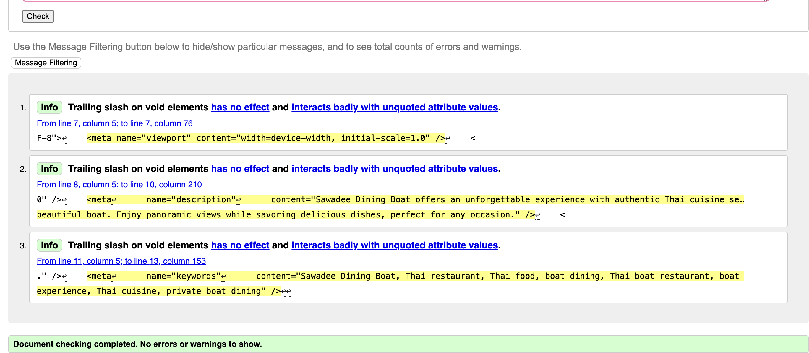
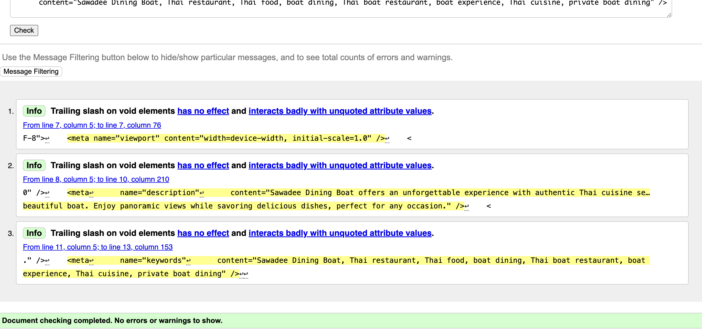
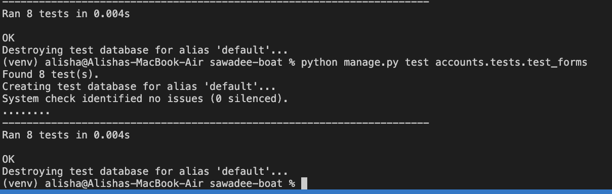

# Testing Documentation for the Project

* [Introduction](#introduction)
* [Test Setup](#test-setup)
* [Automatic Tests](#automatic-tests)
  * [Phone Number Validation](#phone-number-validation)
  * [Birth Date Validation](#birth-date-validation)
  * [Address Validation](#address-validation)
  * [Missing or Invalid Data](#missing-or-invalid-data)
  * [MenuForm Tests](#menuform-tests)
  * [MenuItemForm Tests](#menuitemform-tests)
  * [ItemForm Tests](#itemform-tests)
* [Manual Tests](#manual-tests)
* [Running the Tests](#running-the-tests)
* [Test Results](#test-results)
* [Conclusion](#conclusion)

---

## Introduction

This document outlines the testing strategy for the **Sawadee Dining Boat** project. The objective is to ensure that all forms and user inputs, such as phone numbers, birth dates, addresses, and menu-related forms, behave as expected.

## Test Setup

Before running the tests, ensure that the following requirements are met:
* Python 3.x
* Django 4.x
* Virtual environment set up (e.g., using `venv`)
* All dependencies installed via `pip install -r requirements.txt`

## Validation

### HTML Validation


To ensure my HTML files meet the correct standards, I used the [HTML W3C Validator](https://validator.w3.org)  to validate all my project’s HTML files.

Since my project is built using Django templates, which include Jinja syntax like  and {{ form|crispy }}, I couldn’t simply enter my site’s URL into the validator. The validator doesn’t recognize Jinja code and requires static HTML, so I had to take a different approach for validation.


Validation Process:

For each page, I followed these steps:
- Opened the deployed site via the Heroku app link and navigated to the specific page.
- Viewed the page source (Right-click → “View Page Source” or CTRL+U on Windows / ⌘+U on Mac).
- Copied the entire HTML code using CTRL+A (Windows) / ⌘+A (Mac).
- Pasted the copied code into the Validate by Input section of the W3C validator.
- Checked for any errors or warnings, made necessary fixes, and repeated the validation process until all issues were resolved.

All my HTML pages were successfully validated, receiving a “No errors or warnings to show” message.


| HTML Source Code/Page | Errors | Warnings |
| ---- | ------ | -------- | 
| Home | 0 | 0 |
| About | 0 | 0 |
| Menu | 0 | 0 |
| Set Sail | 0 | 0 |
| Staff Menu | 0 | 0 |
| Add Menu | 0 | 0 |
| Edit Menu | 0 | 0 |
| Delete Menu | 0 | 0 |
| Add Menu Item | 0 | 0 |
| Edit Menu Item | 0 | 0 |
| Delete Menu Item | 0 | 0 |
| Add Item | 0 | 0 |
| Edit Item | 0 | 0 |
| Delete Item | 0 | 0 |
| Profile | 0 | 0 |
| Edit Profile | 0 | 0 |
| Delete Account | 0 | 0 |
| Change Password | 0 | 0 |
| Reservation List | 0 | 0 |
| Create Reservation | 0 | 0 |
| Edit Reservation | 0 | 0 |
| Delete Reservation | 0 | 0 |
| No Access | 0 | 0 |
| Error 400 | 0 | 0 |
| Error 403 | 0 | 0 |
| Error 404 | 0 | 0 |

### Validation Checker

<details>
  <summary>Homepage</summary>


https://validator.w3.org/nu/?doc=https%3A%2F%2Fsawadee-dining-boat-f1458c05b467.herokuapp.com%2F
  </details>

<details>
  <summary>About Page</summary>


https://validator.w3.org/nu/?doc=https%3A%2F%2Fsawadee-dining-boat-f1458c05b467.herokuapp.com%2F
  </details>

  <details>
  <summary>Menu Page</summary>


https://validator.w3.org/nu/?doc=https%3A%2F%2Fsawadee-dining-boat-f1458c05b467.herokuapp.com%2Fmenu%2F
  </details>


  <details>
  <summary>Set Sail Page</summary>


https://validator.w3.org/nu/?doc=https%3A%2F%2Fsawadee-dining-boat-f1458c05b467.herokuapp.com%2Fset-sail%2F
  </details>

  <details>
  <summary>Staff Menu</summary>


Checked by "Validate by input"
  </details>

  <details>
  <summary>Add Menu</summary>


Checked by "Validate by input"
  </details>

  <details>
  <summary>Edit Menu</summary>


Checked by "Validate by input"
  </details>

  <details>
  <summary>Delete Menu</summary>


Checked by "Validate by input"
  </details>

 <details>
  <summary>Add Menu Item</summary>


Checked by "Validate by input"
  </details>

   <details>
  <summary>Edit Menu Item</summary>


Checked by "Validate by input"
  </details>

   <details>
  <summary>Delete Menu Item</summary>


Checked by "Validate by input"
  </details>


  <details>
  <summary>Add Item</summary>


Checked by "Validate by input"
  </details>


 <details>
  <summary>Edit Item</summary>


Checked by "Validate by input"
  </details>

  <details>
  <summary>Delete Item</summary>


Checked by "Validate by input"
  </details>


  <details>
  <summary>Profile Page</summary>


Checked by "Validate by input"
  </details>

  <details>
  <summary>Edit Profile Page</summary>


Checked by "Validate by input"
  </details>

  <details>
  <summary>Delete Profile Page</summary>


Checked by "Validate by input"
  </details>

  <details>
  <summary>Change Password Page</summary>


Checked by "Validate by input"
  </details>


  <details>
  <summary>Reservation List Page</summary>


Checked by "Validate by input"
  </details>

  <details>
  <summary>Edit Reservation Page</summary>


Checked by "Validate by input"
  </details>


  <details>
  <summary>Delete Reservation Page</summary>


Checked by "Validate by input"
  </details>

 <details>
  <summary>No Access Page</summary>


  </details>

 <details>
  <summary>400</summary>


  </details>


 <details>
  <summary>403</summary>


  </details>

 <details>
  <summary>404</summary>


  </details>


<hr>  

### JavaScript Validation

[JSHint](https://jshint.com/) was used to validate the custom JavaScript code in the project.
External JS, for Bootstrap purposes, obtained via [CDN](https://cdnjs.cloudflare.com/ajax/libs/bootstrap/5.2.3/js/bootstrap.min.js) was not validated through JSHint.


| Page | Screenshot | Errors | Warnings |
| ---- | ---------- | ------ | -------- |
| script.js (main JS file)|  | none | 13 |

Warnings Explained:

During validation, 13 warnings were flagged, but they are not critical issues. They are related to:
* The use of async functions, which require ES8+ (esversion: 8).
* The use of const and arrow functions (=>), which are ES6+ features (esversion: 6).
* A misleading line break warning, which does not affect functionality.

Fixes & Improvements:
* Ensured that all custom JavaScript is valid and free of errors.
* Used feature detection (typeof flatpickr !== "undefined") to avoid undefined variable issues.
* Adjusted code formatting to improve readability.

Note: The JavaScript in script.js handles:
* Initializing Flatpickr for date inputs (birth_date and booking_date).
* Handling AJAX form submissions for reservations.
* Managing the responsive navigation menu.

Since no errors were found, and all warnings are related to modern JavaScript syntax, the JavaScript code is considered fully valid for this project, and can easily be fixed later. 

<hr>

<hr>

### Python Validation

[CI Python Linter](https://pep8ci.herokuapp.com/#) was used to validate the Python files that were created or edited by myself. No issues presented and line lengths were double checked. I have included some screenshots with the results below.

| Feature | admin.py | forms.py | models.py | urls.py | views.py |
|---------|----------|----------|-----------|---------|----------|
| Accounts (app) | [no errors](documentation/testing/accountsadminpy.png) | [no errors](documentation/testing/forms_accounts.png) | [no errors](documentation/testing/models_accounts.png) | [no errors](documentation/testing/urls_accounts.png) | [no errors](documentation/testing/views_accounts.png) | 
| Info (app)| [no errors](documentation/testing/admin_info.png) | [no errors](documentation/testing/forms_info.png) | [no errors](documentation/testing/models_info.png) | [no errors](documentation/testing/urls_info.png) | [no errors](documentation/testing/views_info.png) |
| Reservations (app)| [no errors](documentation/testing/admin_reservations.png) | [no errors](documentation/testing/forms_reservations.png) | [no errors](documentation/testing/models_reservations.png) | [no errors](documentation/testing/urls_reservations.png) | [no errors](documentation/testing/views_reservations.png) |
| Sawadee Dining Boat (project)| no file | no file | no file | [no errors](documentation/testing/urls.sawadee.png) | no file |

<hr>


### CSS Validation 

[W3C CSS Validator](https://jigsaw.w3.org/css-validator/) was used to validate my CSS file. External CSS for Bootstrap, provided by [CDN](https://cdnjs.cloudflare.com/ajax/libs/bootstrap/5.2.3/css/bootstrap.min.css) was not tested. Warnings were present, these were related to my use of variables for colors and fonts in my CSS file.


  
<hr> 

   
### Lighthouse Scores

Lighthouse testing was carried out in Incognito mode to acheive the best result. Performance was lower than preferred due to the site being image heavy. Images used in the sites design were saved in webp and png format, and compressed using [tinypng](https://tinypng.com/) and [Convertio](https://www.convertio.co) to offer the best chance for a decent performance score. The CDNs used for Bootstrap were also noted in the Lighthouse report as causing issue with performance. This report will be reviewed for future development of Freefido to raise this score.

**Desktop**  

  
*Desktop Home Page*  
  
  
*Desktop Article Page*
  
**Mobile**  

 
*Mobile Home Page*  
  
 
*Mobile Article Page*
  
<hr> 

### Wave Accessibility Evaluation

  
  
Accessibility was included in every planning stage for FreeFido, through the use of the WAVE report tool I could ensure that any necessary changes were made to make the website as accessible as it could be. A minor contrast issue with a word rendered in orange for the feature theme and the absence of text in article image cards, due to their design, was noted in the report. These will be considered in the next version of FreeFido to better it's score.
  
<hr>  


## Automatic Tests

The project includes a comprehensive set of **automatic tests** that validate the behavior of the form (`ProfileForm`, `MenuForm`, `MenuItemForm`, and `ItemForm`). These tests run automatically using Django’s test framework and ensure that form validation works correctly for various scenarios.


### Testing forms.py in accounts app

All tests passed

<details>
  <summary>Phone Number Validation</summary>


The `phone_number` field in the form is validated by a custom validator to ensure that it:
* Contains only digits.
* Has a length between 9 and 15 digits.

**Test Cases:**
* **Valid Phone Number**: Ensures the form accepts a valid phone number (`1234567890`).
* **Invalid Phone Number Length**: Tests that a phone number shorter than 9 digits or longer than 15 digits is rejected.
* **Non-Digit Phone Number**: Ensures the form rejects a phone number containing non-digit characters (e.g., `12a34567b890`).

```python
def test_valid_phone_number(self):
    form_data = {
        'first_name': 'John',
        'last_name': 'Doe',
        'phone_number': '1234567890',
        'birth_date': '2000-01-01',
        'address': '123 Main St',
    }
    form = ProfileForm(data=form_data)
    self.assertTrue(form.is_valid())
```

Invalid Phone Number Length: Tests that a phone number shorter than 9 digits or longer than 15 digits is rejected.

```python
def test_invalid_phone_number_length(self):
    form_data = {
        'first_name': 'John',
        'last_name': 'Doe',
        'phone_number': '123',  # Invalid phone number (too short)
        'birth_date': '2000-01-01',
        'address': '123 Main St',
    }
    form = ProfileForm(data=form_data)
    self.assertFalse(form.is_valid())
    self.assertEqual(form.errors['phone_number'], ['Phone number must be between 9 and 15 digits.'])
```

Non-Digit Phone Number: Ensures the form rejects a phone number containing non-digit characters (e.g., 12a34567b890).
 
```python
def test_invalid_phone_number_non_digit(self):
    form_data = {
        'first_name': 'John',
        'last_name': 'Doe',
        'phone_number': '12a34567b890',  # Invalid phone number (contains non-digits)
        'birth_date': '2000-01-01',
        'address': '123 Main St',
    }
    form = ProfileForm(data=form_data)
    self.assertFalse(form.is_valid())
    self.assertEqual(form.errors['phone_number'], ['Phone number must only contain digits.'])
```
  </details>
---
<details>
  <summary>Birth Date Validation</summary>

The birth_date field is validated to ensure that:
* The birth date is not in the future.
* The user is at least 18 years old.

* Test Cases:
	•	Future Birth Date: Ensures that a future birth date is rejected.

```python
def test_birth_date_in_future(self):
    form_data = {
        'first_name': 'John',
        'last_name': 'Doe',
        'phone_number': '1234567890',
        'birth_date': str(date.today().year + 1) + '-01-01',
        'address': '123 Main St',
    }
    form = ProfileForm(data=form_data)
    self.assertFalse(form.is_valid())
    self.assertEqual(form.errors['birth_date'], ['Birth date cannot be in the future.'])
```

Underage Birth Date: Ensures that users under 18 are rejected.

```python
def test_underage_birth_date(self):
    form_data = {
        'first_name': 'John',
        'last_name': 'Doe',
        'phone_number': '1234567890',
        'birth_date': str(date.today().year - 17) + '-01-01',  # Underage
        'address': '123 Main St',
    }
    form = ProfileForm(data=form_data)
    self.assertFalse(form.is_valid())
    self.assertEqual(form.errors['birth_date'], ['You must be at least 18 years old.'])
```
  </details>
---
<details>
  <summary>Address Validation</summary>

The address field is validated to ensure that:
* The address does not contain invalid characters (e.g., $, %, &, @).

* Test Cases:
	•	Valid Address: Ensures that a valid address is accepted.

```python
def test_valid_address(self):
    form_data = {
        'first_name': 'John',
        'last_name': 'Doe',
        'phone_number': '1234567890',
        'birth_date': '2000-01-01',
        'address': '123 Main St',  # Valid address
    }
    form = ProfileForm(data=form_data)
    self.assertTrue(form.is_valid())
```

Invalid Address Characters: Ensures that an address containing invalid characters is rejected.

```python
def test_invalid_address_characters(self):
    form_data = {
        'first_name': 'John',
        'last_name': 'Doe',
        'phone_number': '1234567890',
        'birth_date': '2000-01-01',
        'address': '123 Main $t',  # Invalid address (contains $)
    }
    form = ProfileForm(data=form_data)
    self.assertFalse(form.is_valid())
    self.assertEqual(form.errors['address'], ['Address contains invalid characters.'])
```
  </details>
---
<details>
  <summary>Missing or Invalid Data</summary>

Test cases for required fields ensure that:
* Missing fields (like first_name) raise validation errors.

Missing First Name: Ensures that the form raises a validation error when the first_name field is empty.

```python
def test_form_invalid_data(self):
    form_data = {
        'first_name': '',  # Missing first name
        'last_name': 'Doe',
        'phone_number': '1234567890',
        'birth_date': '2000-01-01',
        'address': '123 Main St',
    }
    form = ProfileForm(data=form_data)
    self.assertFalse(form.is_valid())
    self.assertEqual(form.errors['first_name'], ['This field is required.'])
```
  </details>
---

### Automated Forms Tests in Info App


All tests passed

<details>
  <summary>MenuForm Tests</summary>

The MenuForm validates the creation of a menu with name, description, and active status.

Test Cases:
* Valid MenuForm: Ensures the form is valid when given correct data.
 
```python
 def test_menu_form_is_valid(self):
    form = MenuForm({'name': 'Lunch Menu', 'description': 'A delicious lunch menu', 'is_active': True})
    self.assertTrue(form.is_valid(), msg="MenuForm should be valid")
```
Invalid MenuForm: Ensures the form is invalid when the name is missing.

```python
def test_menu_form_is_invalid(self):
    form = MenuForm({'name': '', 'description': 'No name provided', 'is_active': True})
    self.assertFalse(form.is_valid(), msg="MenuForm should be invalid due to missing name")
```
  </details>
---
<details>
  <summary>MenuItemForm Tests</summary>

The MenuItemForm validates the creation of a menu item associated with a menu.

Test Cases:
* Valid MenuItemForm: Ensures the form is valid when given correct data.

```python
  def test_menu_item_form_is_valid(self):
    form = MenuItemForm({'menu': self.menu.id, 'category': 'Drinks'})
    self.assertTrue(form.is_valid(), msg="MenuItemForm should be valid")
```

Invalid MenuItemForm: Ensures the form is invalid when the menu is missing.

```python
def test_menu_item_form_is_invalid(self):
    form = MenuItemForm({'menu': '', 'category': 'Desserts'})
    self.assertFalse(form.is_valid(), msg="MenuItemForm should be invalid due to missing menu")
```
  </details>
---
<details>
  <summary>ItemForm Tests</summary>

The ItemForm validates the creation of an item associated with a menu item, including handling file uploads.

Test Cases:
* Valid ItemForm: Ensures the form is valid when the item has a valid image file.

```python
def test_item_form_is_valid(self):
    image_file = self.create_test_image()
    form = ItemForm(data={
        'menu_item': self.menu_item.id,
        'name': 'Spaghetti',
        'description': 'Delicious spaghetti with tomato sauce',
        'price': 15.99,
    }, files={'image': image_file})
```

Invalid ItemForm due to Large File: Ensures the form is invalid when the uploaded image file is too large.

```python
def test_item_form_is_invalid_due_to_large_file(self):
    large_image = SimpleUploadedFile("large.jpg", b"x" * (2 * 1024 * 1024 +
    self.assertTrue(form.is_valid(), msg=f"ItemForm should be valid but failed with errors: {form.errors}")
```
  </details>
---

### Automated Urls Tests in Info app


All tests passed

<details>
  <summary>Test Setup</summary>

The test setup initializes a superuser and logs them in before executing the URL tests.

Test Cases:
* Creates a superuser for authentication.
* Verifies the user is logged in.


```python
def setUp(self):
    username = "testuser"
    email = "testapp@test.com"
    password = "12339292sss4"
    user_model = get_user_model()
    self.user = user_model.objects.create_superuser(
        email=email,
        password=password,
        username=username
    )
    login = self.client.login(email=email, password=password)
    self.assertTrue(login)
    self.assertTrue(self.user.is_superuser)
```

  </details>
---
<details>
  <summary>Public Page URL Tests</summary>

  These tests verify that public pages load successfully.

Test Cases:
* test_home_page: Tests the home page (/).
* test_about_page: Tests the about page (/about/).
* test_menu_page: Tests the menu page (/menu/).
* test_set_sail_page: Tests the set sail page (/set-sail/).

```python
def test_home_page(self):
    response = self.client.get("/")
    self.assertEqual(response.status_code, 200)

def test_about_page(self):
    response = self.client.get("/about/")
    self.assertEqual(response.status_code, 200)

def test_menu_page(self):
    response = self.client.get("/menu/")
    self.assertEqual(response.status_code, 200)

def test_set_sail_page(self):
    response = self.client.get("/set-sail/")
    self.assertEqual(response.status_code, 200)
```
  </details>
---
<details>
  <summary>Staff Menu URL Tests</summary>

These tests verify that staff menu pages are accessible to logged-in staff members.

Test Cases:
* test_staff_menu_page: Tests the staff menu page (/staff/menu/).
* test_staff_menu_page_logout: Tests staff menu access after logout.

```python
def test_staff_menu_page(self):
    response = self.client.get("/staff/menu/")
    self.assertEqual(response.status_code, 200)

def test_staff_menu_page_logout(self):
    self.client.logout()
    response = self.client.get("/staff/menu/")
    self.assertEqual(response.status_code, 302)  # Redirected to login
```
  </details>
---
<details>
  <summary>Menu Management URL Tests</summary>

  These tests ensure that menu management pages return the expected HTTP status.

Test Cases:
* test_add_menu_page: Tests adding a menu (/staff/menu/add/).
* test_edit_menu_page: Tests editing a menu (/staff/menu/edit/<id>/).
* test_delete_menu_page: Tests deleting a menu (/staff/menu/delete/<id>/).
* test_set_active_menu_page: Tests activating a menu (/staff/menu/set-active/<id>/).

```python
def test_add_menu_page(self):
    response = self.client.get("/staff/menu/add/")
    self.assertEqual(response.status_code, 200)

def test_edit_menu_page(self):
    response = self.client.get("/staff/menu/edit/1/")
    self.assertEqual(response.status_code, 404)  # ID doesn't exist

def test_delete_menu_page(self):
    response = self.client.get("/staff/menu/delete/1/")
    self.assertEqual(response.status_code, 404)  # ID doesn't exist

def test_set_active_menu_page(self):
    response = self.client.get("/staff/menu/set-active/1/")
    self.assertEqual(response.status_code, 404)  # ID doesn't exist
```

  </details>
---
<details>
  <summary>Menu Item (Category) Management URL Tests</summary>

  These tests verify that menu item (category) management routes function correctly.

Test Cases:
* test_add_menu_item_page: Tests adding a menu item (/staff/menu-item/add/).
* test_edit_menu_item_page: Tests editing a menu item (/staff/menu-item/edit/<id>/).
* test_delete_menu_item_page: Tests deleting a menu item (/staff/menu-item/delete/<id>/).

```python
def test_add_menu_item_page(self):
    response = self.client.get("/staff/menu-item/add/")
    self.assertEqual(response.status_code, 200)

def test_edit_menu_item_page(self):
    response = self.client.get("/staff/menu-item/edit/1/")
    self.assertEqual(response.status_code, 404)  # ID doesn't exist

def test_delete_menu_item_page(self):
    response = self.client.get("/staff/menu-item/delete/1/")
    self.assertEqual(response.status_code, 404)  # ID doesn't exist
```

  </details>
---
<details>
  <summary>Item (Dish) Management URL Tests</summary>

  These tests verify that dish/item management pages are accessible.

Test Cases:
* test_add_item_page: Tests adding an item (/staff/item/add/).
* test_edit_item_page: Tests editing an item (/staff/item/edit/<id>/).
* test_delete_item_page: Tests deleting an item (/staff/item/delete/<id>/).

```python
def test_add_item_page(self):
    response = self.client.get("/staff/item/add/")
    self.assertEqual(response.status_code, 200)

def test_edit_item_page(self):
    response = self.client.get("/staff/item/edit/1/")
    self.assertEqual(response.status_code, 404)  # ID doesn't exist

def test_delete_item_page(self):
    response = self.client.get("/staff/item/delete/1/")
    self.assertEqual(response.status_code, 404)  # ID doesn't exist
```

</details>
---
<details>
  <summary>No Access Page URL Test</summary>

  This test ensures that the No Access page (/no-access/) loads successfully.

Test Cases:
* test_no_access_page: Tests the no-access page.

```python
def test_no_access_page(self):
    response = self.client.get("/no-access/")
    self.assertEqual(response.status_code, 200)
```

</details>

### Automated Model Tests in Info app


All tests passed

The following tests ensure that the database models for **Menu**, **MenuItem**, and **Item** work as expected.

#### Menu Model Tests

<details>
  <summary>Menu Model</summary>

The `Menu` model represents a menu containing multiple categories and items.

#### Test Cases:
- **String Representation:** Ensures the `__str__` method returns the menu's name.
- **Menu Creation:** Ensures that a menu can be created, retrieved, and its attributes match the expected values.

```python
def test_menu_str(self):
    """Test the string representation of the Menu model."""
    self.assertEqual(str(self.menu), "Dinner Menu")

def test_menu_creation(self):
    """Test that a menu can be created and retrieved."""
    menu = Menu.objects.get(name="Dinner Menu")
    self.assertEqual(menu.description, "A delicious dinner selection.")
    self.assertTrue(menu.is_active)
```

</details>
---
<details>
  <summary>MenuItem Model</summary>

  The MenuItem model represents categories within a menu.

Test Cases:
* String Representation: Ensures the __str__ method returns the format {menu.name} - {category}.
* MenuItem Creation: Ensures a menu item can be created and correctly associated with a menu.

```python
def test_menu_item_str(self):
    """Test the string representation of the MenuItem model."""
    self.assertEqual(str(self.menu_item), "Lunch Menu - Appetizers")

def test_menu_item_creation(self):
    """Test that a menu item can be created and retrieved."""
    menu_item = MenuItem.objects.get(category="Appetizers")
    self.assertEqual(menu_item.menu.name, "Lunch Menu")
```

</details>
---
<details>
  <summary>Item Model</summary>

  The Item model represents dishes within a menu category.

Test Cases:
* String Representation: Ensures the __str__ method returns the item’s name.
* Item Creation: Ensures an item can be created and retrieved with the correct attributes.
* Foreign Key Relation: Ensures an item is correctly linked to a MenuItem and Menu.

```python
def test_item_str(self):
    """Test the string representation of the Item model."""
    self.assertEqual(str(self.item), "Orange Juice")

def test_item_creation(self):
    """Test that an item can be created and retrieved."""
    item = Item.objects.get(name="Orange Juice")
    self.assertEqual(item.description, "Freshly squeezed orange juice")
    self.assertEqual(float(item.price), 4.99)  # Convert Decimal to float

def test_item_foreign_key(self):
    """Test that an item is correctly related to a menu item."""
    self.assertEqual(self.item.menu_item.category, "Drinks")
    self.assertEqual(self.item.menu_item.menu.name, "Breakfast Menu")
```

</details>
---

### Automated Views Tests in Info app


All tests passed

---
<details>
  <summary>Test Setup</summary>

The test setup initializes test data, including users (normal and staff), menus, menu items, and individual dishes.

Test Cases:
* Creates a regular user and a staff user.
* Creates a sample menu, menu category, and menu item.

```python
def setUp(self):
    self.client = Client()
    self.user = get_user_model().objects.create_user(
        username="testuser", email="user@test.com", password="password123"
    )
    self.staff_user = get_user_model().objects.create_superuser(
        username="staffuser", email="staff@test.com", password="password123"
    )
    self.menu = Menu.objects.create(name="Test Menu", description="Sample menu description", is_active=True)
    self.menu_item = MenuItem.objects.create(menu=self.menu, category="Test Category")
    self.item = Item.objects.create(
        menu_item=self.menu_item,
        name="Test Dish",
        description="Test Description",
        price=9.99,
        image="https://res.cloudinary.com/demo/image/upload/v1581091179/sample.jpg",
    )
```
  </details>
---
<details>
  <summary>Home & About View Tests</summary>

These tests ensure that the home and about pages load successfully and use the correct templates.

Test Cases:
* test_home_view: Ensures the home page loads and renders info/home.html.
* test_about_view: Ensures the about page loads and renders info/about.html.

```python
def test_home_view(self):
    response = self.client.get(reverse("home"))
    self.assertEqual(response.status_code, 200)
    self.assertTemplateUsed(response, "info/home.html")

def test_about_view(self):
    response = self.client.get(reverse("about"))
    self.assertEqual(response.status_code, 200)
    self.assertTemplateUsed(response, "info/about.html")
```
  </details>
---
<details>
  <summary>Menu View Tests</summary>

  These tests verify that the menu page correctly displays an active menu.

Test Cases:
* test_menu_view: Ensures the menu page loads with an active menu and renders info/menu.html.

```python
  def test_menu_view(self):
    response = self.client.get(reverse("menu"))
    self.assertEqual(response.status_code, 200)
    self.assertTemplateUsed(response, "info/menu.html")
    self.assertIn("menu", response.context)
```

  </details>
---
<details>
  <summary>Staff Menu Access Tests</summary>

These tests confirm that staff-only views require authentication.

Test Cases:
* test_staff_menu_requires_login: Redirects unauthenticated users.
* test_staff_menu_accessible_by_staff: Allows staff users to access the menu management page.

```python
def test_staff_menu_requires_login(self):
    response = self.client.get(reverse("staff_menu"))
    self.assertEqual(response.status_code, 302)  # Redirect to login

def test_staff_menu_accessible_by_staff(self):
    self.client.login(email="staff@test.com", password="password123")
    response = self.client.get(reverse("staff_menu"))
    self.assertEqual(response.status_code, 200)
    self.assertTemplateUsed(response, "info/staff_menu.html")
```

  </details>
---
<details>
  <summary>Menu CRUD Permission Tests</summary>

These tests ensure that only staff users can create, edit, and delete menus.

Test Cases:
* test_add_menu_requires_staff: Blocks regular users from adding a menu.
* test_edit_menu_requires_staff: Blocks regular users from editing a menu.
* test_delete_menu_requires_staff: Blocks regular users from deleting a menu.

```python
def test_add_menu_requires_staff(self):
    response = self.client.post(reverse("add_menu"), {"name": "New Menu"})
    self.assertEqual(response.status_code, 302)  # Redirect to login

def test_edit_menu_requires_staff(self):
    response = self.client.post(reverse("edit_menu", args=[self.menu.id]), {"name": "Updated Menu"})
    self.assertEqual(response.status_code, 302)  # Redirect to login

def test_delete_menu_requires_staff(self):
    response = self.client.post(reverse("delete_menu", args=[self.menu.id]))
    self.assertEqual(response.status_code, 302)
```
  </details>
---
<details>
  <summary>Menu Item (Category) CRUD Tests</summary>

These tests ensure that only staff users can create, edit, and delete menu categories.

Test Cases:
* test_add_menu_item_requires_staff: Blocks regular users from adding a menu category.
* test_edit_menu_item_requires_staff: Blocks regular users from editing a menu category.
* test_delete_menu_item_requires_staff: Blocks regular users from deleting a menu category.

```python
def test_add_menu_item_requires_staff(self):
    response = self.client.post(reverse("add_menu_item"), {"category": "New Category"})
    self.assertEqual(response.status_code, 302)

def test_edit_menu_item_requires_staff(self):
    response = self.client.post(reverse("edit_menu_item", args=[self.menu_item.id]), {"category": "Updated Category"})
    self.assertEqual(response.status_code, 302)

def test_delete_menu_item_requires_staff(self):
    response = self.client.post(reverse("delete_menu_item", args=[self.menu_item.id]))
    self.assertEqual(response.status_code, 302)
```
  </details>
---
<details>
  <summary>Item (Dish) CRUD Tests</summary>

  These tests ensure that only staff users can create, edit, and delete menu items.

Test Cases:
* test_add_item_requires_staff: Blocks regular users from adding an item.
* test_edit_item_requires_staff: Blocks regular users from editing an item.
* test_delete_item_requires_staff: Blocks regular users from deleting an item.

```python
def test_add_item_requires_staff(self):
    response = self.client.post(reverse("add_item"), {
        "menu_item": self.menu_item.id,
        "name": "New Dish",
        "description": "New Description",
        "price": 12.99,
        "image": "https://res.cloudinary.com/demo/image/upload/v1581091179/sample.jpg",
    })
    self.assertEqual(response.status_code, 302)

def test_edit_item_requires_staff(self):
    response = self.client.post(reverse("edit_item", args=[self.item.id]), {
        "menu_item": self.menu_item.id,
        "name": "Updated Dish",
        "description": "Updated Description",
        "price": 15.99,
        "image": "https://res.cloudinary.com/demo/image/upload/v1581091179/sample.jpg",
    })
    self.assertEqual(response.status_code, 302)

def test_delete_item_requires_staff(self):
    response = self.client.post(reverse("delete_item", args=[self.item.id]))
    self.assertEqual(response.status_code, 302)
```

  </details>
---
<details>
  <summary>No Access Page Test</summary>

This test verifies that the “No Access” page loads correctly for unauthorized users.

Test Cases:
* test_no_access_page: Ensures the page renders correctly.

```python
  def test_no_access_page(self):
    response = self.client.get(reverse("no_access"))
    self.assertEqual(response.status_code, 200)
    self.assertTemplateUsed(response, "info/no_access.html")
```

</details>


## BUGS

### Bug 1: Invalid Phone Number Input

### Problem:
While running tests for the `ProfileForm`, I encountered an issue with the phone number validation. The form was accepting phone numbers that contained non-numeric characters, which should not be allowed. Specifically, the test failed when I tried to submit a phone number like `12a34567b890`, which contains both digits and letters. 

Without proper validation, such phone numbers could have been processed and stored in the system, potentially causing errors or inconsistencies in data.


### Solution:
To fix this issue, I added an extra validation step in the `validate_phone_number` function to ensure that the phone number contains **only numeric characters**.

I updated the validation function as follows:

```python
def validate_phone_number(value):
    """
    Custom validator for phone number:
    - Ensures the phone number contains only digits.
    - Removes non-digit characters.
    - Ensures the phone number is between 9 and 15 digits.
    """
    if not value.isdigit():  # Added check for non-digit characters
        raise ValidationError("Phone number must only contain digits.")
    
    cleaned_value = ''.join(filter(str.isdigit, value))

    # Ensure phone number length is within the valid range
    if len(cleaned_value) < 9 or len(cleaned_value) > 15:
        raise ValidationError("Phone number must be between 9 and 15 digits.")
    
    return cleaned_value
```

### Potential Bug/ 2
When doing automatic tests for views.py, I passed all tests. But found a warning on UnorderedObjectListWarning, which happens because I was paginating a queryset without an explicit order. To fix this, I had to update my views.py where I paginate the Menu objects.

Before:

```python
menus = Menu.objects.filter(is_active=True)
```


After: 
```python
menus = Menu.objects.filter(is_active=True).order_by("-created_on")
```
